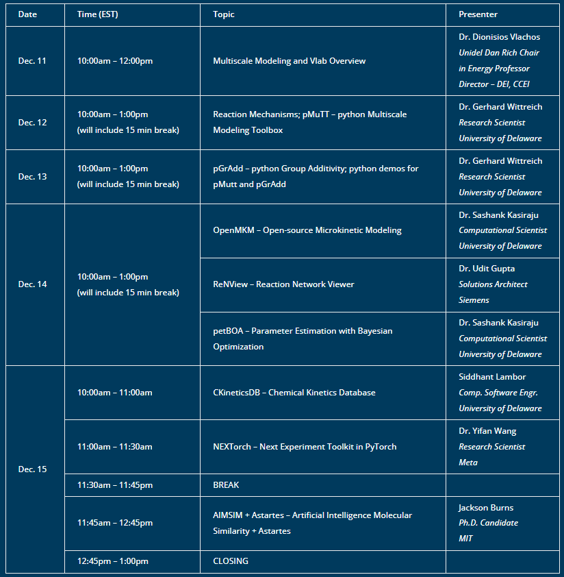

# Virtual Kinetics Lab: On-line Workshop 2023

## Workshop Overview
Virtual Kinetics Lab is a suite of open-source tools that enable multiscale modeling workflow to calculate thermodynamic properties of adsorbates on catalysts, reaction rate constants, reaction pathways and networks, kinetic models, and reaction model and kinetics visualization and analysis.

In this workshop we will present the theory behind the application of multiscale modeling for catalysis and reaction engineering. We will also demonstrate some of the key VLab software to simulate thermochemistry (pMuTT, pGrAdd) and microkinetic models (OpenMKM); visualize reaction network diagrams (ReNView); perform Bayesian design of experiments (NEXTorch); estimate model parameters (petBOA); investigate molecular similarity (AIMSim); and enable a data management framework for the entire workflow (CKineticsDB).

The workshop will be conducted as a webinar hosted on a cloud meeting platform. There will be live demonstrations of selected tools. The workshop is intended for scientists, researchers, and students interested in multiscale modeling. No prior experience is necessary to attend the workshop.

The source-code and documentation for the tools presented in this workshop is available on Vlachos Group GitHub and UD’s RAPID Software Website. The attendees will also be provided installation instructions for the tools and the code examples used for the demos closer to the workshop. However, we do not expect the attendees to work through the examples during the demo. They are encouraged to work through the examples during the week of the workshop after the presentations, so that any queries can be immediately shared with the organizers for feedback and further discussion.

**Required Background Knowledge:** None

**Beneficial Background Knowledge:** Basic knowledge of chemical kinetics, Python, basic knowledge of Docker to run OpenMKM containers.

**Required Software:** Any Operating System (Windows/Mac/Linux) which can run Python Jupyter notebooks and Docker for running OpenMKM. If Docker is unavailable, OpenMKM can be compiled from source but is not recommended for beginners.

## Schedule of Events

